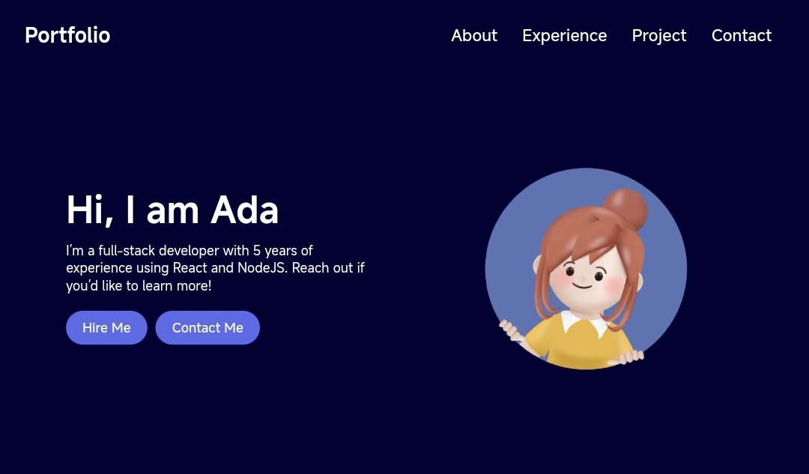

<!-- PROJECT INTRO -->

  

  <h1> React Portfolio Website </h1>

  <h3> This is a React portfolio website template idea </h3>
  

    <a href="https://ReactPortfolioWebsite-ab120.netlify.app"> View Demo </a>
    ·
    <a href="https://github.com/AbdullahAB120/React-portfolio-website/issues/new?labels=bug&template=bug-report---.md"> Report Bug </a>
    ·
    <a href="https://github.com/AbdullahAB120/React-portfolio-website/issues/new?labels=enhancement&template=feature-request---.md"> Request Feature </a>
  

 
 

<!-- ABOUT THE PROJECT -->
## About The Project

This is a Portfolio website template. When I have completed React after HTML, CSS & JS, I made this website for practise purpose. I made this website with most used JS library React. This is a interactive website. Also it is a static website, not a dynamic website. However, you can contact with me for more information. Thank you for visiting my github repo...!

Section of this Website :
* Hero
* Abour
* Experiences
* Skills
* Projects
* Contact

 
 

<!-- BUILT WITH -->
## Built With

 
 
 
 
 
 

<!-- Uses -->
## How to Run

You can run this website with source code(which is located in this repository), following these command :

 
 `npm i`

 
 `npm run dev`

 
 
<!-- CONTRIBUTING -->
## Contributing

Contributions are what make the open source community such an amazing place to learn, inspire, and create. Any contributions you make are **greatly appreciated**.

If you have a suggestion that would make this better, please fork the repo and create a pull request. You can also simply open an issue with the tag "enhancement".
Don't forget to give the project a star! Thanks again!

1. Fork the Project
2. Create your Feature Branch (`git checkout -b feature/AmazingFeature`)
3. Commit your Changes (`git commit -m 'Add some AmazingFeature'`)
4. Push to the Branch (`git push origin feature/AmazingFeature`)
5. Open a Pull Request

 
 

<!-- LICENSE -->
## License

Distributed under the MIT License. See `LICENSE.txt` for more information.

 
 

<!-- CONTACT -->
## Contact 

<a href="https://www.facebook.com/AbdullahAB120"> Facebook </a>
·
<a href="https://www.instagram.com/AbdullahAB_120"> Instagram </a>
·
<a href="https://www.linkedin.com/in/AbdullahAB120"> LinkedIn </a>
·
<a href="https://www.x.com/AbdullahAB120"> Twitter </a>
·
<a href="https://www.fiver.com/AbdullahAB120"> Fiverr </a>
